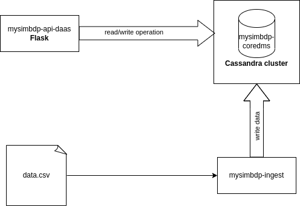
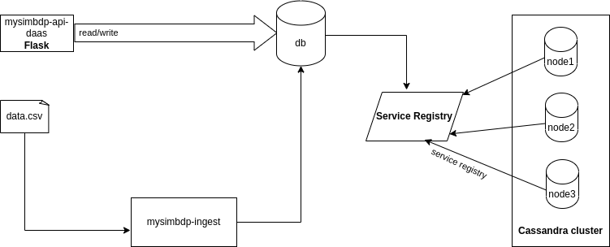
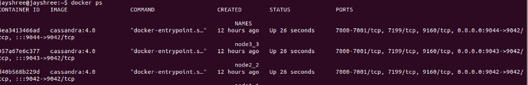
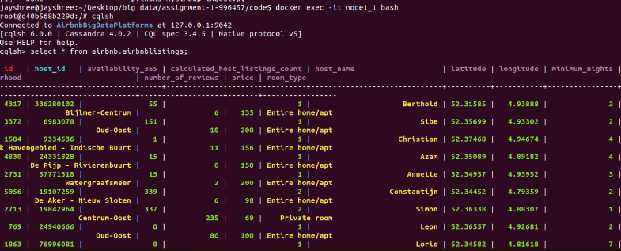
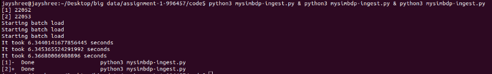

# Part -1 Design

### 1. Explain your choice of types of data to be supported and technologies for mysimbdp-coredms. 

For my application, I am using the Airbnb dataset. It is a relational data where the data is organized in different tables which are related to one another. A RDBMS would have been a possible technology for this type of data. However, for the big data platforms implementation, I opt for NOSQL database. The data types are 

The coredms is implemented with Apache Cassandra database. Apache cassandra is a column oriented database provides various advantages over other databases. It stores massive amount of data and can handle thousands of writes per second. Cassandra doesnt have a master node, which allows it to achieve scalability by using peer-to-peer communication with gossip protocol. The gossip protocol allows nodes to communicate and pass metadata allowing adding of new nodes relatively easy. Since, the data is geographically distributed as there is data for airbnb in every location this will allow cheap, geographic expansion of the database.

### 2. Design and explain interactions between main components in your architecture of mysimbdp

mysimbdp-coredms is the cassandra cluster with 3 nodes. The data.csv file is the file user wishes to ingest, mysimpdb-ingest is the ingestion module to ingest the data to mysimbdp. The mysimbdp-api-daas module is an API, the provides basic functionality of read and write to the coredms. 

### 3. Explain a configuration of a cluster of nodes for mysimbdp-coredms so that you prevent a single-point-of-failure problem for mysimbdp-coredms for your tenants

For this assignment, I have configured a cluster named AirbnbBigDataPlatforms with 3 nodes. Since Cassandra is a peer-to-peer network with no master node, every node has same role in Cassandra. Since, cassandra replicates the data based on replication factor in the nodes, if one node goes down, the other nodes makes sure of the data availability preventing the single point of failure. 

### 4. You decide a pre-defined level of data replication for your tenants/customers. Explain how many nodes are needed in the deployment of mysimbdp-coredms for your choice so that this component can work property.
For this platform, I have kept the replication factor to 2. Which means that there is atleast 2 copies of each row and each copy is in a different node. Since, every node has same role in Cassandra. So, there is no single point of failure. There should be atleast 2 nodes to ensure data availability and consistency. And as a rule of thumb, the replication factor should not exceed the number of Cassandra nodes. Increasing replication factor can alleviate the fault tolerance and ensure high availability. But this increases the latency and decreases the performance. I have 3 cassandra nodes in my design as it allows quorum reads and writes in case one node fails.

### 5. Explain how would you scale mysimbdp to allow many tenants using mysimbdp-dataingest to push data into mysimbdp

One approach to scale for multi-tenant architecture is that each tenant may have different schemas. This hampers with performance and scalability as we store multiple keyspaces in memory. 
Another approach to scale would be to allow multiple tenants where each tenant get their own cluster or a mysimbdp-coredms. This increases the cost significantly, whereas the performance and scalability is traded off. 

# Part -2 Implementation

### Design, implement and explain one example of the data schema/structure for a tenant whose data will be stored into mysimbdp-coredms

A single table for all airbnb listings is implemented in the Cassandra keyspace. The table schema is defined as follows:

**Airbnblistings**
| Field Name | Data Type |
| --- | --- |
| id | int |
| host_id | int |
| host_name | text |
| neighbourhood | text |
| latitude | float |
| longitude | float |
| room_type | text |
| price | int |
| minimum_nights | int |
| number_of_reviews | int |
| calculated_host_listings_count | int |
| availability_365 | int |

The data from the file is first cleaned, some columns are dropped. Neighborhood group column only had NULL data present. Whereas there were multiple redundant columns for reviews like reviews_per_month, number_of_reviews_ltm, last_review which do not add much meaning to the data. Hence, they are removed from the dataset. Since the implementation is for big data it only makes sense to design with limited columns. 

### Given the data schema/structure of the tenant (Part 2, Point 1), design a strategy for data partitioning/sharding and explain your implementation for data partitioning/sharding together with your design for replication 

Cassandra partitions the data based on the partition key and in this case, the partition key and the primary key is id. The parition key is helpful in the case of reading the data and quering the database. As cassandra partitions the data in nodes based on the range of the hash value of the parition key. This makes efficient quering, since when reading data for a specific id, cassandra calculates the hash value and knows exactly which node will have the requested data. This prevents requerying the node in case when the queried node doesn't have the requested data and the request is forwarded to another node. 

### Assume that you are the tenant, write a mysimbdp-dataingest that takes data from your selected sources and stores the data into mysimbdp-coredms. Explain possible consistency options for writing data in your mysimdbp-dataingest

The data ingestion is implemented in mysimbdp-ingest.py that ingests the data from data.csv to the cassandra database. The script provides a batch insertion of all the entries to the specified table. 
BatchStatment in cassandra is generally used to execute multiple modification statements simultaneously. In this scenario, since it is only a data ingestion using a BatchStatement over a SimpleStatement isn't much different. However, using batch statement provides flexibility to further enhance the ingestion for multiple statements to execute parallely. 

There are various different consistency options in Cassandra. THe consistency level can be set to ALL, ONE, TWO, QUORUM. In cassandra, the consistency level is the minimum number of nodes that must acknowlegde a read or write operation before the operation can complete. Defining consistency majorly depends on whether the task is read intensive or write intensive, and how many nodes failure can be handled at a time. 

- ALL: In the all consistency level, both 2 replicas must succeed. In case of write consistency, if any of the node is down during write operation the write operation fails.
- QUORUM: In the QUORUM consistency level, the write consistency must be written to commit log and memtable on a quorum of replica nodes. For my implementation, for a replica of 2, 2 nodes need to respond foe the operation to succeed. 

### Given your deployment environment, show the performance (response time and failure) of the tests for 1,5, 10, .., n of concurrent mysimbdp-dataingest writing data into mysimbdp-coredms with different speeds/velocities together with the change of the number of nodes of mysimbdp-coredms. Indicate any performance differences due to the choice of consistency options

- For performance testing, 70MB of data was ingested with different consistency options- ONE, ALL and QUORUM. Different subprocesses are run parallely to to test the Ingestion speed and runtime. 
The performance analysis table is presented as below: 

**Performance Testing**

| Test | File Size | Consistency Level | Ingestion Processes | Ingestion Time |
| --- | --- | --- | --- | --- |
| 1| 0.4MB | ALL | 1 | 8 seconds |
| 2| 0.4MB | ONE | 1 | 4 seconds |
| 3| 45MB | ALL | 3 |  4.5 minutes | 
| 4| 45MB | QUORUM | 1 | 4 minutes |
| 5| 70MB | ALL | 3 |  10 minutes |
| 6| 70MB | ALL | 1 | 8.9 minutes |
| 7|70MB | QUORUM | 1 | 8 minutes |
| 7| 70MB | QUORUM | 3 | 8.5 minutes | 

As the ingestion process increases, the time increases linearly. With 5 ingestion process running parallely for 70MB of data, I encountered an error of Cassandra unavailability. Using ALL consistency level, provides slower ingestion time and QUORUM seems to be the most optimal option for consistency level for this scenario. 

Another testing was performed with 45MB size with stopping a node to see the performance change. The ingestion failed for multiple processes and ALL consistency when a node was down. Also the ingestion time increased singnificantly. The ALL ingestion failed as for ALL, both replicas must succeed. And when one node is down, the ingestion fails when multiple write/ingestion operations are performed parallely as the required number of nodes aren't active.

### Observing the performance and failure problems when you push a lot of data into mysimbdp-coredms, propose the change of your deployment to avoid such problems.

Several errors where faced when implemented mysimbdp-coredms. Since, I am implementing batch ingestion it is important to clear the batch after the operation is complete. Else, the cassandra gives an error of Batch size too large. The ingestion speed is relatively very small compared to industry standards. One reason for this could be that I am using cassandra in my local machine with very limited hardware resources. More RAM, a stronger CPU and GPU needs to be allocated as the physical platforms that are required to handle big data needs to be strong and robust. 

# Part 3 - Extension

### Using your mysimdbp-coredms, a single tenant can create many different databases/datasets. Assume that you want to support the tenant to manage metadata about the databases/datasets, what would be your solution? 

- A possible solution is to centralize the information of cassandra metadata. Tool like Zookeeper which is a centralized service mainly used for maintaining configuration information can be implemented along with Apache Cassandra. Zookeeper allows the group of nodes to coordinate between themselves and maintain shared data with robust synchronization. 

- Another program level solution would be to implement the script in such a way that tenant can input the columns and keyspace name s/he wants to add. The script can be changed based on the tenant's inputs.

### Assume that each of your tenants/users will need a dedicated mysimbdp-coredms. Design the data schema of service information for mysimbdp-coredms that can be published into an existing registry so that you can find information about which mysimbdp-coredms is for which tenants/users 

- Service registry is a database that contains network locations of service instances. In our mysimbdp-coredms this is implemented using a service registry tool called Zookeeper. Zookeeper has a concept of ephemeral nodes which can be used to implement service registry. A new ephemeral node is added everytime, a service is instantiated. If the service goes down, the ephemeral node is automatically removed. Apache curator is used for service discovery mechanism on top of zookeeper. A service needs to self register at start-up using curator. 

### Explain how you would change the implementation of mysimbdp-dataingest (in Part 2) to integrate a service discovery feature

- To integrate a service discovery feature in dataingest an initial service discovery step must be added before connecting to coredms. It can be done by running a zookeeper in a docker container and the python library for Zookeeper called kazoo. After the zookeeper is started, we get the client port details. This is used to connect to zookeeper. After connecting to zookeeper, we intialize the curator framework and start it. And initialize the hashmap to store URI name to zNode mapping. The register and discover method can be later used, for service registry and discovery. 

###  Assume that now only mysimbdp-daas can read and write data into mysimbdp-coredms, how would you change your mysimbdp-dataingest to work with mysimbdp-daas? 

The mysimbdp-dataingest now performs batch operation through locally available csv files. This can be extended to work with mysimbdp-daas which can be accessible through public API. The code to read, write in the database is implemented in dataingest file. A modular approach is to be implemented for the code. The mysimbdp-daas is now separately connecting to cassandra client. This can be changed as for every incoming HTTP request, an event is triggered that calls the functions from mysimbdp-coredms. 

### Assume that you design APIs for mysimbdp-daas so that any other developer who wants to implement mysimbdpdataingest can write his/her own ingestion program to write the data into mysimbdp-coredms by calling mysimbdp-daas. Explain how would you control the data volume and speed in writing and reading operations for a tenant?

Volume and read/write speed can be controlled by implementing a queue so that the read/write operation doesn't overwhelm the nodes. Another option would be implement backpressure control and implement batch sizes. 

## Appendix

